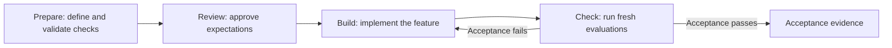

# EDD Kit

**Prepare executable acceptance criteria before implementing an LLM feature.**

EDD Kit helps you define what a feature must do, build it with your coding agent, and check
the result against reviewed expectations. Use it for a new feature or an existing application,
even if you have no evaluation suite yet.

Your agent authors the cases and DeepEval metrics. EDD's local Python CLI validates and runs
them, keeping evidence you can inspect locally or use in CI. No EDD cloud account is required.

[Step-by-step guide](docs/getting-started.md) · [Quick demo](#install-and-try) ·
[Use on your project](#use-on-your-project) · [Results](#understand-results) ·
[Documentation](#next-steps)

New to EDD? Follow the [complete getting-started guide](docs/getting-started.md) from installation
through specialist review, implementation, fresh acceptance evidence, and optional CI.

## How it works



**Prepare** turns your request into a behavior contract, test cases, graders, and controls
(known good and bad examples that test the graders). It runs the available baseline—the
application before implementation, or a stub—to establish the starting point.

**Review** means inspecting and approving the expected behavior and labels. **Build** implements
against those checks. **Check** runs the controls and candidate implementation, then verifies
the evidence. Missing review or incomplete evidence remains visible; it cannot count as a pass.

## Install and try

### 1. Install the CLI

Use **Python 3.11–3.13**, **Linux or macOS**, and **uv**:

```bash
uv tool install edd-kit
edd doctor
```

`uv` installs `edd` into an isolated tool environment, including the tested DeepEval backend. If
your shell cannot find it, run `uv tool update-shell`, restart the shell, and try `edd --help`.
For source development and wheel checks, see [Contributing](CONTRIBUTING.md#development-environment).

### 2. See the core idea

Run the isolated, offline walkthrough:

```bash
edd demo cancellation
```

It checks a working implementation and demonstrates that the same graders reject a fabricated
success and an unauthorized order change. The temporary project is removed afterward, and the
result is explicitly a synthetic demonstration rather than approval or production evidence.

### 3. Choose your working style

The recommended path keeps feature authoring in your coding-agent chat:

```bash
cd /path/to/your-project
edd init  # Codex integration is the default
```

Use `edd init --agent claude` for Claude Code or `--agent none` for direct CLI authoring. Restart
the coding-agent session if initialization installed new skills, then use:

```text
$edd-prepare Add an assistant that cancels an eligible order owned by the user.
```

At any point, `edd status` gives a project dashboard and `edd status CHANGE` shows the current
phase, blocker, responsible actor, and exact next action. Use `--verbose` for evidence details or
`--json` for agents and CI.

For direct terminal authoring, initialize with `--agent none`, create a draft with
`edd prepare CHANGE --brief "Intended behavior"`, and follow the action shown by `edd status CHANGE`.
See [Authoring](docs/authoring.md) for the native suite interface.

### Extended offline example

This synthetic order-cancellation application uses real DeepEval metrics with deterministic
grading. It needs no model-provider credentials and makes no model calls.

In the same terminal, create a temporary project:

```bash
cd "$(mktemp -d)"
edd init --agent none
edd prepare cancellation --template cancellation --brief "Cancel owned orders safely"
edd inspect cancellation --json
```

Read `evals/cancellation/brief.md`, `contract.json`, `cases.json`, `controls.json`, and `suite.py`
in that directory. The checks inspect order state and action history, including unauthorized
changes that are later reversed. These are demonstration fixtures, not production acceptance criteria.

Preview the reviewer-oriented summary:

```bash
edd review cancellation
edd review cancellation --write
```

Commit `evals/cancellation/REVIEW.md` and review it in the pull request. Record domain approval only
after its scenarios represent the intended rule:

```bash
edd review cancellation --area domain --decision approve --by "Your name" \
  --note "The scenarios represent the intended cancellation rule" \
  --criteria-digest DIGEST_FROM_REVIEW_PACKET
edd audit cancellation
edd review cancellation --area technical --decision approve --by "Your name" \
  --note "The controls and passing audit measure the reviewed rule" \
  --criteria-digest DIGEST_FROM_REVIEW_PACKET
```

Use `request_changes` or `needs_discussion` with `--subject requirement:ID`, `case:ID`, or
`control:ID` to attach feedback. Feedback never edits the criteria; revise the canonical files,
regenerate `REVIEW.md`, inspect the semantic diff, and approve the new digest explicitly.

Run the stub to see the missing behavior:

```bash
edd run cancellation --target stub --stage baseline
```

**Expected: FAIL, exit code 1.** The evaluation ran successfully; the stub cannot cancel orders.
Continue with the included working implementation:

```bash
edd run cancellation --target candidate --stage candidate
edd verify cancellation
edd status cancellation
```

**Expected: PASS** for the candidate and verification. To see defects caught, run
`edd run cancellation --target noop` (claims success without changing state) or
`edd run cancellation --target wrong-owner` (omits authorization). Both should fail acceptance.

## Use on your project

With the CLI environment active, change to **your application's repository** and initialize EDD.
Choose the integration matching your workflow:

| Workflow | Run in the terminal | Use in agent chat |
| --- | --- | --- |
| Codex | `edd init --agent codex` | `$edd-prepare`, `$edd-build`, `$edd-check` |
| Claude Code | `edd init --agent claude` | `/edd-prepare`, `/edd-build`, `/edd-check` |
| Direct CLI / Python | `edd init --agent none` | Author the suite yourself; see [Authoring](docs/authoring.md) |

Initialization preserves existing files and reports conflicts. For example, in **Codex chat**:

```text
$edd-prepare Add an assistant that cancels an eligible order owned by the user.
```

Answer consequential product questions and review the generated expectations. Once preparation
is ready, use the change name it created (for example, `cancellation`), one step at a time:

```text
$edd-build cancellation
$edd-check cancellation
```

The terminal scaffold creates a **draft**: replace its starter cases, graders, controls, and
adapters with checks for your feature. See the [workflow guide](docs/workflow.md) for review,
baselines, and resuming work.

Provider-backed graders need configured credentials, a positive cost policy, and `--allow-paid`.
The offline example does not establish the quality of a live model or application.

## Understand results

| Result | Meaning | Gate exit code |
| --- | --- | --- |
| PASS | Complete evidence satisfies the current acceptance policy | 0 |
| FAIL | Valid observations establish a policy violation | 1 |
| ERROR | Configuration, execution, or evidence integrity is invalid | 2 |
| INCONCLUSIVE | Required evidence, coverage, review, or freshness is missing | 3 |

- **Run fresh checks:** `edd check` infers the change and application target when each is unique.
  Otherwise use `edd check CHANGE --target candidate`. Add
  `--report-dir .edd/CHANGE/report --revision REV` to write one Markdown/JSON evidence bundle.
- **Verify saved evidence:** `edd verify CHANGE` assesses existing records without running evaluations.
- **Export saved evidence:** `edd report CHANGE --acceptance --output-dir PATH` creates the same
  report while labelling reused runs as saved rather than fresh.
- **Inspect progress:** `edd status CHANGE` shows the guided workflow view; add `--verbose` for
  detailed evidence or `--json` for the stable machine-readable form.
  `edd report CHANGE --run ID` shows a recorded run's evidence. These diagnostic commands return
  success when the query succeeds; use `check` or `verify` as acceptance gates.

A failing baseline can be the expected starting point. A candidate can pass without a comparable
baseline, or improve while still failing acceptance. If no meaningful baseline is available,
record why with `edd baseline-unavailable CHANGE --reason "Reason"`.

Criteria edits invalidate affected review and runs. Target edits invalidate candidate evidence.
Refresh the relevant checks after changes; see [Revising and resuming](docs/workflow.md#revise-and-resume).

## What lives in your repository

```text
your-project/
├── edd.toml              # EDD configuration
├── evals/CHANGE/         # Brief, contract, suite, cases, controls, dependency lock
│   ├── REVIEW.md         # Generated specialist packet; commit and review in the PR
│   └── review.json       # Digest-versioned domain and technical decisions
├── targets/CHANGE/       # Application and stub adapters
└── .edd/                 # Local evidence and progress; ignored by Git
```

You own the acceptance suite. To update installed agent skills, preview with
`edd sync --agent codex`, then add `--apply`; locally edited skills are preserved as conflicts.

EDD runs **reviewed, cooperative code**. Its process separation is not a hostile-code sandbox,
and local review records do not authenticate reviewers. Treat datasets and reports as sensitive;
use repository review and protected CI for approval policy. See [Security](SECURITY.md).

## Next steps

- [Step-by-step guide](docs/getting-started.md) — installation through review, acceptance, and CI.
- [Workflow and CI](docs/workflow.md) — preparation, review, implementation, and team adoption.
- [Authoring reference](docs/authoring.md) — contract schema, Python suite interface, and target protocol.
- [Invoice extraction example](examples/invoice-extraction/README.md) — another domain, including an existing application.
- [Contributing](CONTRIBUTING.md) — development setup, tests, and distribution checks.
- [Implementation](docs/implementation.md) and [verification record](docs/verification.md) — internals and validation evidence.
- [Usability protocol](docs/usability.md) — task-based validation for the guided experience.

Licensed under the [MIT License](LICENSE).
