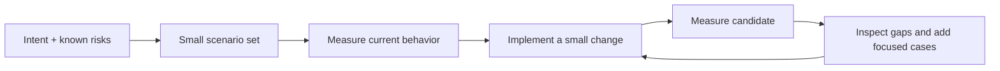

# EDD Kit

**Measure LLM behavior while you build it.**

EDD Kit adds a small, persistent measurement loop to coding-agent development. The agent turns
feature intent into executable scenarios and metrics. The local CLI runs them, records evidence,
and compares compatible measurements.

A specification is a starting hypothesis. A golden set is a living dataset. Neither has to be
complete before useful development begins.

## The default loop



EDD separates two questions:

- **Did the measurement execute?** `COMPLETE`, `INCONCLUSIVE`, or `ERROR`.
- **What behavior did it observe?** `PASS`, `FAIL`, or `INCOMPLETE`.

A completed measurement may report `FAIL`. That is useful feedback, not a broken evaluation run.

## Install and try

Use Python 3.11–3.13 on Linux or macOS:

```bash
uv sync --locked --extra deepeval --group dev
source .venv/bin/activate
edd doctor
edd demo cancellation
```

The demo is offline and synthetic. It demonstrates the mechanics; it does not certify a production
application.

## Use with a coding agent

Skills are the primary interface because the agent already reads product context, writes code, and
can propose scenarios. The CLI remains the deterministic execution and evidence layer.

```bash
cd /path/to/your-project
edd init --agent codex  # or: claude, none
```

Restart the agent session after installing skills, then use:

```text
$edd-prepare Add an assistant that cancels an eligible order owned by the user.
$edd-build cancellation
$edd-check cancellation
```

The skills keep the main path short:

1. Reuse an existing spec or write a brief intent.
2. Create a small set of representative scenarios with provenance.
3. Measure the current target.
4. Implement and measure short slices.
5. Add focused scenarios when a new failure class appears.

The CLI does not generate domain scenarios. The coding agent proposes them from repository context,
traces, reviewed examples, and synthetic boundaries. Humans remain responsible for consequential
expectations.

## Direct CLI loop

```bash
edd init --agent none
edd prepare cancellation --brief "Cancel owned orders safely"
edd inspect cancellation --json

edd measure cancellation --target stub --stage baseline --profile dev
# save the returned run_id

edd measure cancellation --target candidate --stage candidate --profile dev \
  --compare-to BASELINE_RUN_ID

edd compare cancellation --before BASELINE_RUN_ID --after CANDIDATE_RUN_ID
edd status cancellation
```

`edd measure` writes `report.md` and `report.json` under the change's local evidence directory,
or under `--report-dir` when supplied. Reports show case-level observations, provenance, deferred
cases, cost, gaps, and comparison limits.

Numeric deltas are available only when the evaluation bundle and execution profile match. If cases,
metrics, fixtures, or policy changed, EDD shows the scenario diff and asks you to rerun both
application versions with the current bundle.

## Living scenario sets

Each case records where its input and expected behavior came from. Prefer production traces and
reviewed domain examples, then use synthetic cases for boundaries and rare risks.

When the expected behavior is unresolved, mark the case deferred. It remains visible in status and
reports but receives no pass/fail decision. This keeps uncertainty explicit without blocking every
other scenario.

Ten to twenty diverse starting cases is often enough to begin. It is an orientation, not a minimum
coverage claim.

## Optional strict acceptance

Some teams need a formal release gate. EDD retains the stricter workflow with reviewed positive and
negative grader controls, domain and technical approval records, acceptance-profile runs, and
verification:

```bash
edd status cancellation --acceptance
edd audit cancellation
edd review cancellation --write
edd check cancellation --target candidate --report-dir .edd/cancellation/acceptance
```

Use this branch when the risk or governance need justifies it. The default development loop does
not require controls or approval records.

## Files

```text
your-project/
├── edd.toml
├── evals/CHANGE/         # Brief, contract, cases, metrics, fixtures
├── targets/CHANGE/       # Application and stub adapters
└── .edd/                 # Local runs and reports; ignored by Git
```

User-authored evaluation files remain editable. Earlier run records retain the criteria that
produced them, so later edits do not rewrite history.

## Next steps

- [Workflow](docs/workflow.md)
- [Authoring reference](docs/authoring.md)
- [Current product thesis](idea.md)
- [Research: spec-driven development](docs/research-sdd-landscape-2026-09.md)
- [Research synthesis and critique](docs/vision-review-2026-09.md)
- [Contributing](CONTRIBUTING.md)
- [Security and trust boundaries](SECURITY.md)

Licensed under the [MIT License](LICENSE).
