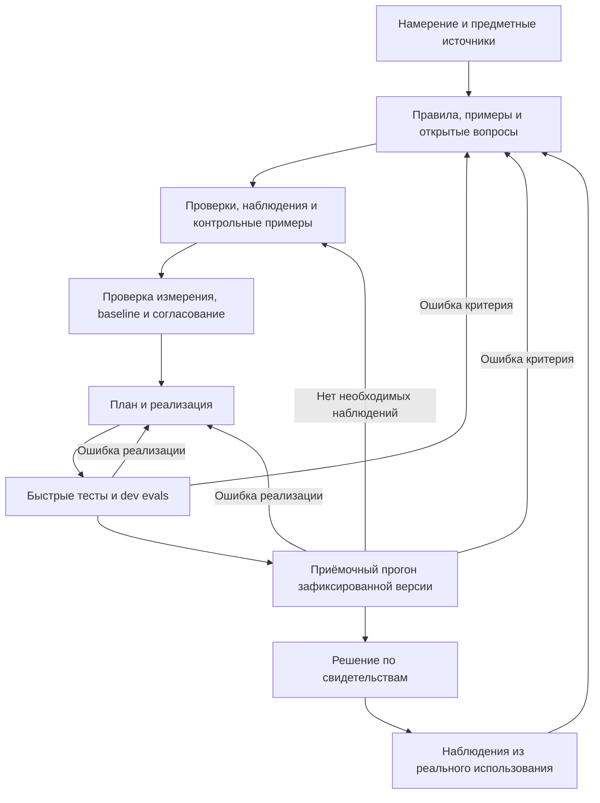

# EDD Kit: критика идеи и проверяемая модель продукта

Дата: **15 сентября 2026 года**.

Это исследование и проектное предложение в ответ на исходное видение «спецификация → eval → агентная разработка → улучшение по обратной связи». Оно учитывает уже существующий EDD Kit, но не заменяет автоматически [текущее видение](../idea.md) или [контракт реализации](implementation.md). Код в рамках этого исследования не менялся.

Метод: чтение первичных документов и отдельных исходников инструментов, сопоставление с локальными документами и реализацией. Это не сравнительный запуск продуктов, исследование рынка или наблюдение за пользователями. Описанные возможности конкурентов подтверждают пересечение, но не доказывают их удобство. Источники проверены на указанную дату; страницы и ветки `main` могут меняться. Дополнительный разбор SDD — в [отдельной исследовательской записке](research-sdd-landscape-2026-09.md).

## 1. Вывод

**Направление полезное. Самостоятельная ценность продукта пока остаётся гипотезой.**

Сильная мысль: агент должен получать заранее обсуждённый способ проверки результата, а завершение работы должно сопровождаться проверяемыми свидетельствами. Это помогает сделать расхождения в ожиданиях видимыми до реализации и сохранять найденные ошибки в следующих итерациях.

Уязвимое предположение: последовательность документов и запусков сама по себе обеспечивает правильную разработку. Можно получить согласованные между собой спецификацию, проверки и код, которые одинаково неверно понимают задачу. Дополнительные этапы не исправляют отсутствие предметного знания.

Предлагаемое определение:

> **EDD Kit помогает команде превратить намерение в проверяемые критерии приёмки до реализации следующего поведения, проверить качество этих критериев и вести агентную разработку с актуальными доказательствами результата.**

Подтверждённый пользователем фокус: **начать с LLM-функций, затем расширять подход**. Предлагаемая начальная аудитория — разработчики, которые с coding agents создают LLM-функции и регулярно согласуют правильность с владельцем предметной области. Подход подходит и новому проекту, и существующему приложению без eval suite. Наличие исторического дефекта или готового golden set не должно быть условием входа.

Главная продуктовая гипотеза: **подготовка и поддержка согласованной приёмки обходятся дешевле и дают меньше ошибочных решений, чем тот же eval backend с обычным review и его штатными agent skills**.

## 2. Что необходимо разделить

### 2.1. Объект проверки

| Что разрабатываем | Что преимущественно проверяем |
| --- | --- |
| Обычное приложение, код которого пишет агент | Бизнес-правила, интерфейсы, состояние, интеграции, производительность и UX обычными тестами и предметным review |
| LLM-функцию: извлечение, поиск, помощника | Предыдущие проверки плюс вариативные результаты, смысловые критерии, поведение на наборах сценариев |
| Самого coding agent или его инструкции | Качество законченных изменений на независимых задачах, затраты и регрессии процесса |

Использование AI для написания кода не делает LLM-оценщика обязательным. Для правила доступа к чужому заказу точная проверка состояния и авторизации полезнее общего балла «корректность ответа».

Начать сразу со всех трёх объектов означает проектировать несколько разных продуктов. В первой версии выбираем второй, используя существующего coding agent для реализации. Проверка качества самого coding agent — отдельный будущий эксперимент.

### 2.2. Четыре разных артефакта

| Артефакт | Вопрос |
| --- | --- |
| Спецификация поведения | Что нужно пользователю, в каких условиях, какие результаты допустимы и что запрещено? |
| План оценки | На каких сценариях, какими наблюдениями и проверками это можно оценить? Где проверка неполна? |
| Baseline | Что реально умеет текущая система при этих условиях? |
| План реализации | Какие изменения предположительно приведут к нужному результату? |

«Эвристический план» из исходной идеи лучше разложить на эти обязанности. Замер не является планом разработки, а список метрик не заменяет спецификацию.

### 2.3. Измерение, приёмка и польза

Рост наблюдаемого результата с 40% до 70% означает улучшение на измеренной выборке. При целевом пороге 90% этого недостаточно для приёмки. И даже прохождение приёмки не доказывает, что пользователи захотят пользоваться функцией.

Нужны три явно различимых вывода: **что изменилось; выполнено ли условие приёмки; подтверждена ли полезность в реальном использовании**. Последнее требует пользовательской обратной связи или продуктового эксперимента.

## 3. Что уже существует и что заимствовать

| Практика или инструмент | Подтверждённое пересечение | Следствие для EDD |
| --- | --- | --- |
| BDD / Example Mapping | Обсуждение истории, правил, конкретных примеров и открытых вопросов до разработки. [Cucumber](https://cucumber.io/docs/bdd/example-mapping/) | Согласовывать примеры и спорные правила; не требовать сначала большой документ |
| GitHub Spec Kit | Спецификации, планы, задачи и агентный workflow. Подробности и ограничения — в [разборе SDD](research-sdd-landscape-2026-09.md), [документация команд](https://github.github.com/spec-kit/reference/agentic-sdd.html) | Использовать существующие спецификации и идентификаторы требований |
| Kiro | Требования, design, задачи и property-based testing. [Документация](https://kiro.dev/docs/specs/correctness/) | Преобразование требований в исполняемые проверки уже имеет прямые аналоги |
| OpenSpec | Управление изменениями спецификаций и настраиваемым workflow. [Схема процесса](https://openspec.dev/docs/schemas/spec-driven) | Учесть небольшие изменения и возвращение к требованиям по мере обучения |
| DeepEval | Coding agent запускает evals, читает результаты, меняет prompts, retrieval, tools или код и повторяет проверку. [Agent workflow](https://deepeval.com/docs/vibe-coding) | Цикл «агент → eval → исправление» уже существует; выбранный backend даёт существенную часть механики |
| Promptfoo | Калибровка LLM-оценщика по человеческим меткам, отдельная проверочная выборка, версии и мониторинг; есть agent skills. [Judge guide](https://www.promptfoo.dev/docs/guides/llm-as-a-judge/), [skills](https://www.promptfoo.dev/docs/integrations/agent-skill/) | «Проверяем проверяющих» — необходимое свойство, но слабое самостоятельное отличие |
| LangSmith | Offline/online evaluations, наборы данных, разделение выборок, человеческая разметка и сравнения. [Evaluation concepts](https://docs.langchain.com/langsmith/evaluation-concepts) | Не строить собственную платформу данных и наблюдаемости до доказанной потребности |
| DSPy | Оптимизация prompts и, для соответствующих оптимизаторов, весов модели относительно заданной метрики. [Исходник документации](https://github.com/stanfordnlp/dspy/blob/main/docs/docs/learn/optimization/optimizers.md) | Автоматическая оптимизация может быть исполнителем внутри процесса; она не определяет за пользователя правильную цель |

Anthropic прямо рекомендует задавать будущие возможности через evals до того, как агент научится их выполнять. Поэтому заявление об изобретении eval-first разработки не выдерживает проверки. [Engineering guide](https://www.anthropic.com/engineering/demystifying-evals-for-ai-agents).

Мой вывод из пересечения: перспектива — **удобный процесс согласования и поддержания приёмки**, с измеримым преимуществом для конкретной команды. Совокупность ингредиентов не доказывает ни уникальность, ни готовность людей внедрять новый kit.

## 4. Основные ошибки, которые стоит предотвратить

### 4.1. Правило «перед любой разработкой» слишком жёсткое

Для исследования неизвестного интерфейса может понадобиться прототип. Для простой правки может хватить одного существующего теста. Многоступенчатое согласование каждой мелочи добавит задержку, не обязательно улучшив решение.

Предлагаемая норма: **до реализации значимого поведения определить доступные свидетельства успеха; глубину подготовки выбирать по неоднозначности и последствиям ошибки**. Для исследовательского прототипа заранее фиксируется вопрос, бюджет и способ получить ответ. После исследования формируется контракт той части, которая пойдёт в продукт.

Писать fixtures, adapters и проверки до production implementation допустимо и необходимо. Требование «никакого кода до eval» логически блокировало бы создание самого eval.

### 4.2. Нулевой результат может ничего не измерять

Оценщик, всегда возвращающий `0`, не проверяет приложение. Рабочий оценщик, который запускается на заглушке и обнаруживает отсутствие поведения, даёт полезный baseline. Он не обязан показать ровно 0%: заглушка может случайно соблюдать запреты или возвращать правильный формат.

До разработки нужно показать хотя бы:

- приемлемый подготовленный результат проходит соответствующую проверку;
- правдоподобный неправильный результат отклоняется по нужной причине;
- исходное приложение или заглушка действительно исполнялись, а ошибки инфраструктуры видны отдельно.

Если приложение уже выполняет задачу, исходный прогон может быть зелёным. Искусственно создавать провал не нужно. Если baseline недоступен, сохраняется причина отсутствия данных.

### 4.3. Спека и eval могут унаследовать одну ошибку

Если агент решил, что отменять чужой заказ разрешено, он способен написать такую спецификацию, такой golden и такой код. Их взаимное согласие ничего не скажет о правильности политики.

Для критичных правил нужен источник истины вне этой цепочки: владелец бизнес-правила, действующая политика, реальная система учёта или независимо разобранный пример. Второй агент полезен как критик, но его наличие само по себе не устанавливает независимость.

Нужно проверять отдельно смысл ожидаемого результата, способность grader различать результаты и достоверность наблюдений из приложения. Ошибки возможны на каждом из трёх уровней.

### 4.4. Golden set — ограниченное представление задачи

Для extraction точные поля часто подходят. Для полезного объяснения допустимых формулировок много. Для операций главным результатом может быть изменение состояния. Сравнение с единственной строкой будет отвергать хорошие решения или принимать похожие по тексту плохие.

Предлагаю хранить вместе со сценарием: исходные условия, ожидаемое поведение, допустимые альтернативы, запрещённые действия, источник метки и нерешённые вопросы. Дополнять примеры свойствами. Например, повторный запрос отмены не должен создавать повторный побочный эффект; смена формулировки без смены смысла не должна менять право на операцию.

Количество строк не равно покрытию. Двадцать перефразировок одного запроса не покрывают отсутствие заказа, неверного владельца и сбой инструмента.

### 4.5. Агент может улучшить измерение вместо поведения

Возможные способы получить зелёный результат: ослабить рубрику, уменьшить порог, удалить трудные случаи, подобрать ответы под известные примеры или повторять шумный прогон до удачи.

Во время исправления реализации критерии приёмки сохраняются. Исправлять неверный grader разрешено через отдельное обоснованное изменение: показать исходное свидетельство ошибки, изменить критерий, пересмотреть контрольные примеры и получить новые результаты. Для сравнения версий старую и новую реализации оценивают по сопоставимым критериям.

Полностью запретить менять eval тоже ошибка: тогда команда будет вынуждена реализовывать неправильное требование. Нужна различимость двух действий: **исправление продукта** и **исправление определения правильности**.

### 4.6. LLM-оценщик тоже является измеряемой системой

Исследование MT-Bench/Chatbot Arena показало смещения, связанные с порядком ответов, многословием и предпочтением собственных ответов. Полученное авторами согласие с людьми относится к их эксперименту; оно не задаёт качество grader в вашем домене. [Оригинальная работа](https://arxiv.org/abs/2306.05685).

Для EDD предлагаю проверять ложные принятия и ложные отказы отдельно, по каждому важному критерию. Общее согласие 95% может скрывать принятие всех пяти опасных случаев среди 100 преимущественно хороших примеров. Спорная человеческая метка должна оставаться спорной, а не превращаться в уверенный golden после генерации.

### 4.7. Зелёный прогон не является доказательством надёжности

Расчёт для иллюстрации: при нуле ошибок в 100 независимых испытаниях с одинаковой вероятностью ошибки односторонняя точная 95%-ная верхняя граница этой вероятности равна `1 − 0.05^(1/100) ≈ 2.95%`. Это вывод из биномиальной модели; основа метода описана у [NIST](https://www.itl.nist.gov/div898/software/dataplot/refman2/auxillar/exacbici.htm).

Повторные ответы на одни и те же несколько сценариев не становятся новой выборкой реальных пользовательских задач. Неоднородность сценариев, общий сбой provider и подбор числа запусков после просмотра результатов ограничивают этот расчёт.

Для MVP достаточно честных чисел: сколько сценариев, попыток приложения, повторов оценщика, ошибок и пропусков. Порог по наблюдаемой доле прохождения — операционное условие приёмки, пока нет отдельного обоснования статистического утверждения.

### 4.8. Ответ агента не доказывает выполнение действия

«Заказ отменён» не означает, что нужная запись действительно изменилась. И правильное конечное состояние не исключает временного запрещённого действия, которое агент позже откатил.

Для значимых операций нужны наблюдения из контролируемого хранилища или журнала действий. Для некоторых требований важен порядок, например проверка права до изменения заказа. Последовательность внутренних шагов без предметной необходимости фиксировать не следует.

### 4.9. «Агент улучшает себя» смешивает разные циклы

Правка prompt, retrieval или workflow меняет приложение. Правка instructions coding agent меняет процесс разработки. Обучение весов модели — ещё одна операция. Обычная итерация с feedback не означает автоматического обучения модели.

В первой версии фиксируем процесс разработки и оцениваем изменения приложения. Изменения самого процесса впоследствии проверяем на нескольких независимых задачах. Иначе непонятно, за счёт чего получено улучшение и сохранится ли оно вне текущего примера.

## 5. Предлагаемый рабочий цикл

Внешний интерфейс сохраняет понятные **Prepare → Build → Check**. Внутри это небольшой повторяющийся цикл для одного поведения.



Переход из неудачного приёмочного прогона зависит от причины: ошибка реализации возвращает к Build, ошибочный критерий — к Prepare, недоступная среда — к её восстановлению. Схема показывает основной путь; инфраструктурные ошибки не следует лечить случайными правками приложения.

| Этап | Конкретный результат | Условие завершения |
| --- | --- | --- |
| Уточнение | Маленькое изменение, цель, ограничения, предметные источники | Существенные неоднозначности разрешены либо явно выведены из текущего объёма |
| Дизайн оценки | Сценарии, graders, способ наблюдения, ограничения времени и стоимости | Для каждого принимаемого требования известен способ проверки; пробелы не скрыты |
| Проверка измерения | Положительные и отрицательные controls, проверка сбора состояния | Известные различия обнаруживаются нужными проверками; ошибки коллектора различимы |
| Baseline и review | Реальный исходный прогон или причина недоступности; решения по критериям | Участники понимают, что считается правильным и какие данные это подтвердят |
| Build | План, небольшие изменения, диагностические прогоны | Обнаруженные ошибки разобраны; готов конкретный кандидат |
| Check | Свежие результаты для версии кандидата и текущих критериев | Выполнена объявленная политика либо явно указан FAIL/ERROR/INCONCLUSIVE |
| Обратная связь | Разобранные реальные случаи и новые регрессии | Есть следующая осмысленная поправка; не автоматическое принятие любой жалобы как истины |

У review две ответственности: предметная («мы хотим такое поведение») и техническая («эта проверка его измеряет»). Это не обязательно два человека или две встречи. Степень независимости выбирает команда с учётом последствий ошибки. Агент может подготовить материалы и объяснить их; автоматически выдуманная подпись не является человеческим решением.

## 6. Пример контракта: отмена заказа

Учебная политика: авторизованный пользователь может отменить собственный заказ до отправки. Пример конкретизирует метод; это не универсальное правило магазина и не новая схема конфигурации EDD.

| ID | Условия | Приемлемый результат | Обязательное свидетельство |
| --- | --- | --- | --- |
| C1 | Свой заказ, ещё не отправлен | Отменён нужный заказ, ответ соответствует действию | Состояние нужной записи и журнал операции |
| C2 | Заказ другого пользователя | Отказ; запрещённого изменения нет | Авторизация и отсутствие операции, включая позже отменённую |
| C3 | Заказ уже отправлен | Объяснение ограничения, состояние сохранено | Состояние и журнал |
| C4 | Повтор того же запроса | Корректное сообщение о текущем статусе, без повторного эффекта | История изменений и повторных вызовов |
| C5 | Данных недостаточно | Уточнение, без произвольного выбора заказа | Отсутствие изменения и содержание уточнения |
| C6 | Инструмент отмены сообщает ошибку | Нет ложного сообщения об успешной отмене | Ответ инструмента, состояние, пользовательский ответ |

Для C2 отрицательный control должен иметь правдоподобный нормальный ответ и корректный формат, но запрещённое действие. Тогда отказ grader проверяет авторизацию, а не случайно сломанный JSON. Положительный control должен включать допустимую альтернативную формулировку.

Отдельно запускаются дефектные реализации: «всегда говорит, что отменил», «пропускает проверку владельца», «выполняет действие дважды». Проверка сохранённого результата испытывает grader; запуск дефектной реализации дополнительно испытывает передачу наблюдений из приложения. Общий принцип внесения дефектов для проверки тестов уже реализован в mutation testing. [Stryker](https://stryker-mutator.io/docs/).

Цепочка для одного критерия:

```text
Правило R-owner
  → сценарий C2
  → grader G-owner
  → положительные/отрицательные controls для G-owner
  → наблюдения запуска конкретного target
  → решение по R-owner
```

Для критичных запретов один достоверный контрпример блокирует приёмку этой версии. Ноль контрпримеров означает отсутствие нарушений в проверенном объёме, а не обещание невозможности нарушения в production. Реальную авторизацию приложение обязано обеспечивать своим кодом.

## 7. Данные и циклы проверки

### Две независимые задачи разделения данных

| Что настраиваем | Данные для настройки | Что нужно для отдельной проверки |
| --- | --- | --- |
| Приложение / prompt | Доступные разработчику dev cases | Приёмочные сценарии; для утверждения о переносе на новые случаи — независимо собранная выборка |
| Grader / рубрику | Controls для калибровки | Другие размеченные controls для проверки качества grader |

Приёмочная выборка не обязательно скрытая. Открытые тесты полезны как контракт и регрессии. Но открытый многократно используемый набор нельзя выдавать за независимое доказательство обобщения. Файл `holdout` рядом с кодом не создаёт секретность. После использования его результатов для настройки степень независимости меняется.

При небольшом объёме данных не следует механически создавать четыре пустых набора. Лучше явно описать роли имеющихся примеров и ограничить выводы. Новые проверочные примеры можно получить от предметного эксперта после завершения итерации.

### Частота и остановка

- После локальной правки — подходящие быстрые тесты и затронутые dev cases.
- Перед передачей на приёмку — зафиксировать кандидата, выполнить необходимый аудит graders и объявленный acceptance plan.
- При изменении модели, rubric, значимых данных или среды — обновить затронутые свидетельства и проверить сопоставимость.
- Из production — отбирать реальные случаи, разбирать метки и добавлять регрессии с происхождением.

Цикл останавливается при выполненной приёмке, исчерпанном бюджете, недоступности необходимых данных либо отсутствии прогресса после заранее выбранного числа итераций. В последних случаях результат — диагностическое заключение и следующая гипотеза. Повторение до первого случайного PASS не является приёмочной политикой.

Грубая оценка затрат на запуск: число сценариев × попытки приложения × стоимость попытки, плюс число оценок × повторы graders × стоимость оценки, плюс аудит и инфраструктура. Человеческое время на разметку, review и fixtures учитывается отдельно. Эти величины лучше показывать до запуска, а неизвестную цену обозначать неизвестной.

Для результатов сохраняются четыре состояния текущего EDD: PASS, FAIL, ERROR, INCONCLUSIVE. Развёртывание остаётся решением существующего delivery workflow. Приёмочные проверки дополняют обычные тесты, review архитектуры и проверку реального UX.

## 8. Каким должен быть продукт

### 8.1. Минимальный интерфейс поверх существующего backend

Пользователь начинает с намерения, существующего кода и доступных предметных примеров. Agent skill помогает подготовить артефакты. CLI/CI исполняет проверки и сообщает текущую фазу, проблему и следующий шаг.

Глубина такого модуля — в объёме скрытой координации: какие критерии изменились, какое review устарело, какой запуск ещё относится к текущей реализации, какие данные неполны. Если пользователь обязан самостоятельно связывать всё это вручную, добавленная конфигурация не окупается.

Сохраняем native Python / DeepEval как authoring interface. Собственный универсальный язык метрик, новый coding agent и конструктор всех возможных pipelines не нужны для проверки ценности первой версии.

Если проект использует Spec Kit, OpenSpec или Kiro, EDD должен ссылаться на существующие требования. Не следует поддерживать два независимо редактируемых текста одного бизнес-правила. Интеграцию с конкретным SDD-инструментом выбираем по реальному проекту пилота.

### 8.2. Интерфейс согласования

Основная единица review — сценарий с предметным смыслом. Первое представление может быть текущим Markdown-пакетом в PR. Отдельный UI оправдан, если это мешает специалистам участвовать.

Пример будущего представления:

| Поле | Что увидит эксперт |
| --- | --- |
| Правило | «Отмена доступна только владельцу» |
| Сценарий | Человек просит отменить заказ другого клиента |
| Ожидание | Отказ; заказ и история запрещённых действий не изменены |
| Пример ошибочного успеха | Ассистент вежливо сообщает об отмене и действительно меняет чужой заказ |
| Проверка | Наблюдение из хранилища и журнала; состояние control audit |
| Изменение | Было / стало и причина пересмотра |
| Решение | Согласен / исправить ожидание / обсудить |

Эксперт подтверждает смысл и примеры; инженер проверяет механизм наблюдения и grader. Техническую схему согласовывают, когда её поля или правила имеют значение для предметного решения. Отдельный визуальный pipeline builder не нужен для ответа «должно ли это поведение считаться правильным».

Открытый вопрос должен быть полноценным состоянием. Кнопка массового approve без понимания примеров создаст формальную процедуру, а не согласование.

### 8.3. Что может и чего не доказывает локальная фиксация

Хеши и review records полезны для обнаружения изменений и привязки результатов к версиям. Они сами не устанавливают личность reviewer, хронологию разработки или независимость исполнения. Это уже отражено в [SECURITY.md](../SECURITY.md).

Для командного merge нужны настройки репозитория и доверенные CI checks. GitHub документирует обязательные review и status checks, включая выбор приложения — источника статуса; сила защиты зависит от настройки и прав обхода. [Protected branches](https://docs.github.com/en/repositories/configuring-branches-and-merges-in-your-repository/managing-protected-branches/about-protected-branches).

Защищённые скрытые datasets и исполнение недоверенного кода требуют отдельной инфраструктуры. Это возможное расширение при конкретной потребности, а не автоматически достигнутое свойство локального CLI.

## 9. Состояние текущего репозитория

Здесь уже есть рабочая основа предложения. Следующий эксперимент не требует переписывать kit с нуля.

| Область | Что обнаружено | Чего это ещё не устанавливает |
| --- | --- | --- |
| Prepare → Build → Check | [Текущее видение](../idea.md), [README](../README.md), packaged skills | Что реальные пользователи проходят цикл без помощи автора |
| Требования и профили | [models.py](../src/edd_kit/models.py): critical requirements, пороги, число trials, лимиты | Статистическую обоснованность выбранных порогов |
| Cases и controls | [suite.py](../src/edd_kit/suite.py): альтернативы, запреты, происхождение, разделение controls | Предметную правильность автоматически сгенерированных меток |
| Review и изменения | [review.py](../src/edd_kit/review.py): предметные/технические решения, версии и semantic diff | Подлинность reviewer или достаточность независимого review |
| Решение по данным | [decisions.py](../src/edd_kit/decisions.py), [reporting.py](../src/edd_kit/reporting.py) | Полноту реальных сценариев и доверенность внешнего сборщика состояния |
| Демонстрации и проверки | [Verification record](verification.md) содержит результаты локальных проверок и синтетических walkthrough | Эффективность на реальных LLM-функциях и доказанную пользу командам |
| Продуктовый пилот | [Usability protocol](usability.md) уже предлагает две пары инженер–эксперт | Результат пилота: в verification record сказано, что реальные пользовательские сессии не проводились |

Для этой записки документы и выбранные исходники прочитаны; тестовая матрица и walkthrough заново не запускались. Числа предыдущей верификации не выдаются за результат текущего исследования.

Особенно удачны уже принятые решения: существующий backend, нативное authoring, возможность старта без eval suite, честное отсутствие baseline, разные состояния результата и редактируемые пользователем артефакты. Их стоит сохранить.

Что необходимо проверить дальше: стоимость подготовки реальных fixtures, качество предложенных агентом критериев, способность эксперта заметить неправильное ожидание, работа с шумным provider, понятность остановки и повторное применение. Исторические audit-first документы не следует автоматически возвращать в статус текущего направления.

## 10. Как проверить ценность за 4–6 недель

Это предлагаемый план эксперимента, а не оценка гарантированного срока или уже проведённое исследование. Основа — существующий [протокол пилота](usability.md).

### Неделя 1: зафиксировать проверяемую гипотезу

Выбрать двух инженеров с предметными экспертами и реальные небольшие LLM-функции. Желательно проверить вход с существующим приложением и вход без готовой eval suite. Зафиксировать исходный процесс каждой команды и взять реальные обезличенные примеры, доступные на законных основаниях.

Заранее определить, что будет считаться полезной коррекцией, ложным блокированием, завершённой подготовкой и добровольным повторным использованием. Число примеров выбирается для разбора поведения, а не для произвольного обещания production reliability.

### Недели 2–3: пройти полный цикл существующим kit

Эксперт читает review packet без Python/JSON, исправляет хотя бы одно спорное ожидание, видит изменение смысла и рассматривает итоговые свидетельства. Инженер готовит fixtures, выполняет реальные прогоны и возвращается в работу после перерыва или новой сессии агента.

Наблюдатель записывает вмешательства. Если автор кита незаметно доделал половину подготовки, это часть стоимости внедрения.

### Неделя 4: сравнить с сильной альтернативой

Сравнение — тот же backend, обычное review и доступные штатные agent skills. Предоставить сопоставимый доступ к исходным требованиям и экспертному времени. Использовать разные сопоставимые задачи или новых участников, чтобы повторное решение уже знакомой задачи не искажало результат.

Независимый разбор законченных изменений должен учитывать ошибки, которых не было в доступной разработчику выборке. Сравнить затраты подготовки, реализации и исправлений. Собственный score EDD не является основным показателем его пользы.

### Недели 5–6: проверить повторение и решить, что строить

Попросить участников выбрать инструмент для следующей подходящей функции без обучения заново. Дорабатывать только препятствия, которые реально помешали результату: например, слишком трудный adapter или непонятный review packet.

| Сигнал | Что измерять |
| --- | --- |
| Вход | Время до первого meaningful baseline или явной причины его отсутствия |
| Подготовка | Ручные исправления criteria, graders, fixtures; число вмешательств автора |
| Согласование | Понимает ли эксперт ожидания и замечает ли неверные метки без чтения кода |
| Качество | Независимо подтверждённые ошибки, полезные исправления и ложные отказы |
| Цена | Время инженера и эксперта, provider cost, обслуживание между изменениями |
| Продолжение | Возобновление после паузы и выбор EDD для следующей функции |

Предлагаемый качественный критерий продолжения: полный реальный цикл понятен участникам, есть конкретная полезная коррекция приёмки и хотя бы одна пара добровольно повторяет применение при приемлемой для неё цене. Две пары дают сигнал для следующего эксперимента; они не доказывают превосходство метода или размер рынка.

Если ценность сводится к одному хорошему review packet — развивать его и skills. Если участникам достаточно native backend — рассмотреть интеграцию или вклад в него. Если они регулярно теряют согласования и актуальные доказательства — это основание расширять самостоятельный kit. Если проблема именно в участии экспертов — тогда проверять отдельный UI.

## 11. Рекомендуемые решения сейчас

1. Сохранить EDD Kit как рабочее имя, позиционировать пользу через подготовку и поддержание приёмки.
2. Начать с LLM-функций, разрабатываемых coding agents; не требовать существующего eval pipeline.
3. Готовить контракт для следующего значимого поведения, оставляя место ограниченному исследованию.
4. Считать spec, eval design, baseline и implementation plan отдельными обязанностями.
5. Проверять смысл меток, качество graders и сбор наблюдений отдельно.
6. Оставить текущий локальный CLI, DeepEval и agent skills основой пилота.
7. Начать согласование с текущего Markdown/PR-представления; отдельный UI обосновать наблюдаемой проблемой.
8. Зафиксировать операционные лимиты и правила пересмотра критериев; завершение не определяется случайным удачным прогоном.
9. Оценивать kit по независимым ошибкам, затратам и повторному использованию.
10. Следующей инвестицией сделать реальные пилоты. Технический прототип в репозитории уже существует.

**Итоговая формулировка для пользователя продукта:**

> Опишите нужное поведение. EDD поможет согласовать примеры и проверки, передать их coding agent и получить понятный ответ: что действительно выполнено, что ещё не работает и каких данных пока не хватает.
